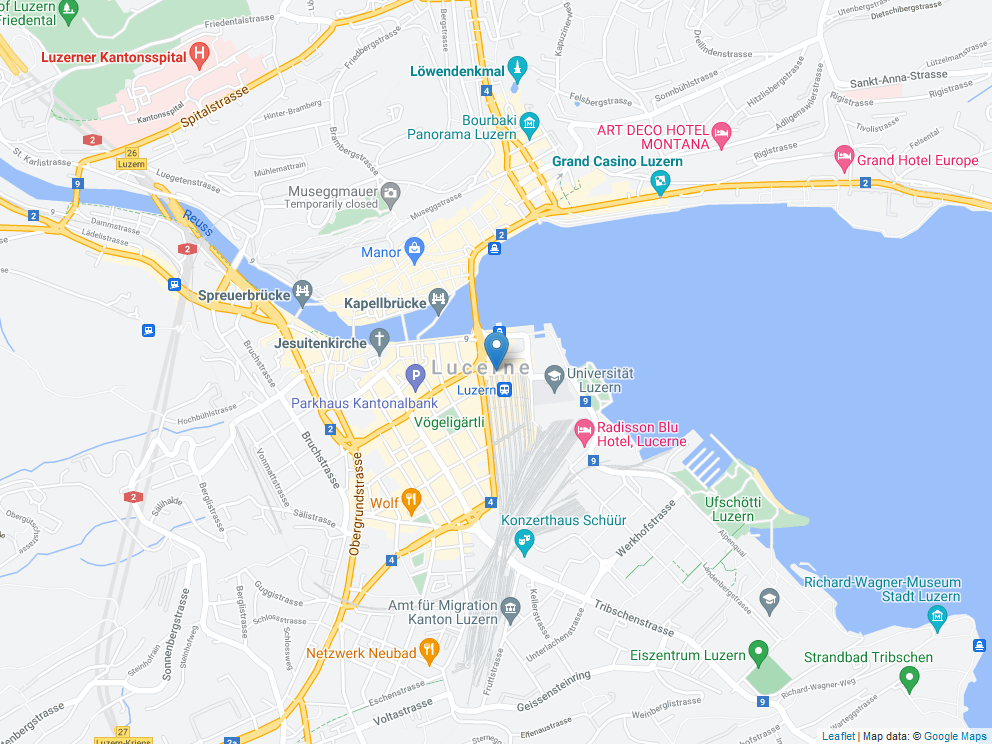

During work I learned, that showing people insights from data in a geographic form is extremely intuitive and accessible for all kind of professionals. While doing several reports in different tools I looked for the best suitable basemaps to carry my analysis over to the people who need to look at the report. I hope that a simple post to show how to use different basemaps or background layers in `leaflet` for R serves you well in a similar need as I had. Please note, that I myself am not a trained geographer, which is why the maps used here focus more on those that a general public would use. Also, most of the services, restrict the number of accesses made per user such that the explanations here are only useful if you plan to make simple maps for yourself or a limited number of other users.

# Preparations

So the first step in R of course would be to load the necessary packages in R.

```{r}
library(leaflet)
library(sf) # to create a point to draw on the map
```

```{r echo=FALSE}
# Defines a function to create maps to be later displayed as images
map_image <- function(tile_url, attribution_info, location, filename){
  
  # define path to store and delete if file existing
  fpath <- paste0(getwd(), "/maps/", filename, ".png")
  if (file.exists(fpath)) {file.remove(fpath)}
  
  # create map and save
  leaflet() %>% 
  addTiles(urlTemplate = tile_url,
           attribution = attribution_info) %>% 
  addMarkers(data = location) %>% 
  mapview::mapshot(file = fpath)
}
```

First let's define an arbitrary coordinate to center our map on using the `sf` package. For this example I go with the city of Lucerne in Switzerland.

```{r}
lucerne <- st_sfc(st_point(x = c(8.31, 47.05 )))
st_crs(lucerne) <-  'WGS84'
```

# Create maps

Everyone who used `leaflet`in R before, knows the default *OpenStreetMap* layer. For this, you simply leave the `addTiles()` function, which adds a base layer, empty such that the defaults are used

```{r}
leaflet() %>% 
  addTiles() %>% 
  addMarkers(data = lucerne)
```

Using the `addProviderTiles()` function ue can conveniently choose among several background maps. See http://leaflet-extras.github.io/leaflet-providers/preview/ for a neat overview of all the included maps.

```{r}
leaflet() %>% 
  addProviderTiles(provider = "Stamen.Terrain") %>% 
  addMarkers(data = lucerne)
```

`leaflet` however allows pretty much any open available *XYZ (Tiled web map)* to be used as background. Below, I provide a function call for you to see, how the practical implementation in a script works. A great source of basemaps may be governmental agencies. For Switzerland the federal agency *swisstopo* offers a broad range of such maps

```{r}
leaflet() %>% 
  addTiles(urlTemplate = "https://wmts20.geo.admin.ch/1.0.0/ch.swisstopo.pixelkarte-farbe/default/current/3857/{z}/{x}/{y}.jpeg",
           attribution = '&copy; <a href="https://www.geo.admin.ch/de/about-swiss-geoportal/impressum.html#copyright">swisstopo</a>') %>% 
  addMarkers(data = lucerne)
```

In the function call you have to provide the URL of the XYZ tile as value for the `urlTemplate` argument. Make sure that the CRSs of your XYZ tile map and your leaflet object match (i.e. typically WGS84).

# List of Services


```{r echo=FALSE}
### create maps to be displayed

## roads

# google maps road
map_image(tile_url = "https://mt1.google.com/vt/lyrs=m&x={x}&y={y}&z={z}",
          attribution_info = 'Map data: &copy; <a href="https://cloud.google.com/maps-platform/terms">Google Maps</a>',
          location = lucerne,
          filename = "google_maps_road"
          )

# swisstopo road color
map_image(tile_url = "https://wmts20.geo.admin.ch/1.0.0/ch.swisstopo.pixelkarte-farbe/default/current/3857/{z}/{x}/{y}.jpeg",
          attribution_info = '&copy; <a href="https://www.geo.admin.ch/de/about-swiss-geoportal/impressum.html#copyright">swisstopo</a>',
          location = lucerne,
          filename = "swisstopo_color"
          )

## satellite
# google maps road
map_image(tile_url = "https://mt1.google.com/vt/lyrs=s&x={x}&y={y}&z={z}",
          attribution_info = 'Map data: &copy; <a href="https://cloud.google.com/maps-platform/terms">Google Maps</a>',
          location = lucerne,
          filename = "google_maps_satellite"
          )

# swisstopo satellite
map_image(tile_url = "https://wmts20.geo.admin.ch/1.0.0/ch.swisstopo.swissimage/default/current/3857/{z}/{x}/{y}.jpeg",
          attribution_info = '&copy; <a href="https://www.geo.admin.ch/de/about-swiss-geoportal/impressum.html#copyright">swisstopo</a>',
          location = lucerne,
          filename = "swisstopo_satellite"
          )

## hybrid
# google maps road
map_image(tile_url = "https://mt1.google.com/vt/lyrs=y&x={x}&y={y}&z={z}",
          attribution_info = 'Map data: &copy; <a href="https://cloud.google.com/maps-platform/terms">Google Maps</a>',
          location = lucerne,
          filename = "google_maps_hybrid"
          )

```


Here is a short list of basemaps i personally thought are useful. Note that some maps may cover only limited areas. I hope i can extend the list over the months to come. In the list, I also provided a suggested attribution to include when you use them with *fair use* terms. However, I refuse to take any responsibility for any legal challenges you may face from using the mentioned maps in this blog post in any of your use cases you may have. 

## Roads

Service | Link (copy & paste into addTiles()) | Suggested Attribution | Preview
--- | --- | --- | --- 
Google Maps | https://mt1.google.com/vt/lyrs=m&x={x}&y={y}&z={z} | &copy; <a href="https://cloud.google.com/maps-platform/terms">Google Maps</a> | {height=100}
swisstopo | https://wmts20.geo.admin.ch/1.0.0/ch.swisstopo.pixelkarte-farbe/default/current/3857/{z}/{x}/{y}.jpeg | &copy; <a href="https://www.geo.admin.ch/de/about-swiss-geoportal/impressum.html#copyright">swisstopo</a> | {height=100}

## Satellite Imagery

Service | Link (copy & paste into addTiles()) | Suggested Attribution | Preview
--- | --- | --- | --- 
Google Maps | https://mt1.google.com/vt/lyrs=s&x={x}&y={y}&z={z} | &copy; <a href="https://cloud.google.com/maps-platform/terms">Google Maps</a> | {height=100}
swisstopo | https://wmts20.geo.admin.ch/1.0.0/ch.swisstopo.swissimage/default/current/3857/{z}/{x}/{y}.jpeg | &copy; <a href="https://www.geo.admin.ch/de/about-swiss-geoportal/impressum.html#copyright">swisstopo</a> | {height=100}

## Hybrid maps

Service | Link (copy & paste into addTiles()) | Suggested Attribution | Preview
--- | --- | --- | --- 
Google Maps | https://mt1.google.com/vt/lyrs=y&x={x}&y={y}&z={z} | &copy; <a href="https://cloud.google.com/maps-platform/terms">Google Maps</a> | {height=100}

If you happen to know some other great basemaps to be used or see any errors, feel free to leave a comment or open an issue over at the github repository of this website.

# R Session Info

```{r}
sessionInfo()
```
